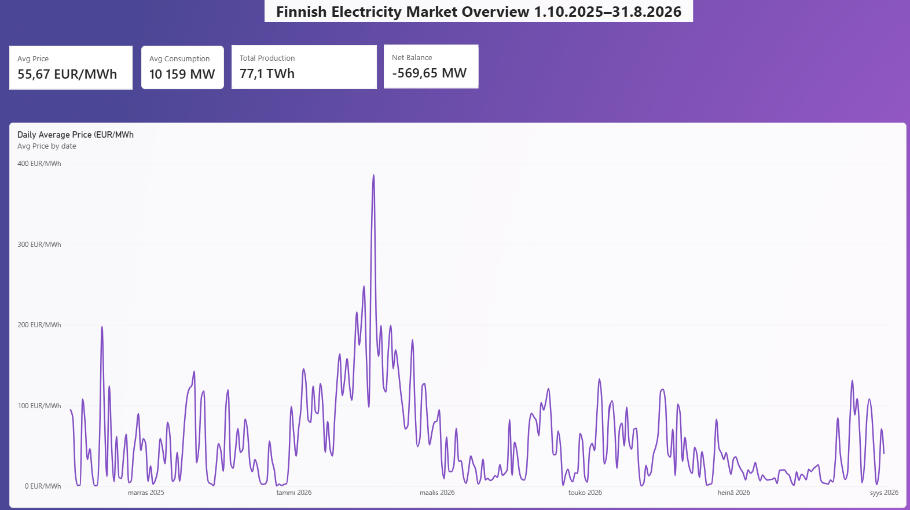
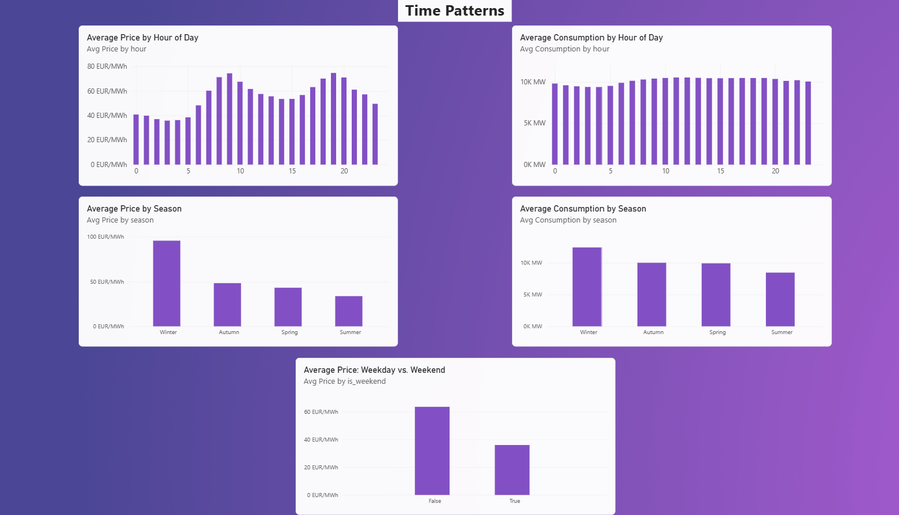
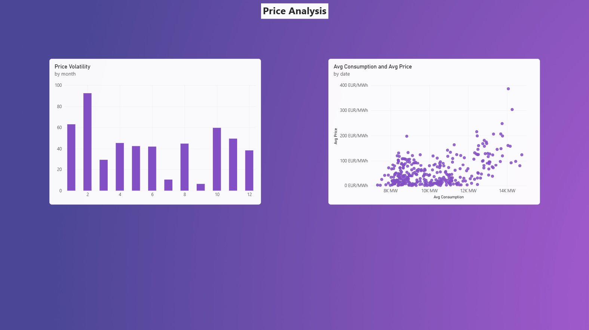

# Finland Electricity Market Analytics

An end-to-end data pipeline that collects electricity consumption, production, 
and price data for Finland, processes it using Databricks and PySpark, and 
presents the results in Power BI.

This project was built to practice working with real data platforms and 
business intelligence tools, using real electricity market data from Finland.

## Data Sources

This project uses two open APIs:

**Fingrid Open Data API**
- Electricity consumption and production data 
for Finland, updated every 15 minutes. No cost, but requires a free API key.

**ENTSO-E Transparency Platform**
- Day-ahead electricity prices for the 
Finnish market. Also free, but requires registration.

The data covers the period from **October 1, 2025 to August 31, 2026**. 
September 2025 was left out because Nordic electricity markets switched 
from hourly to 15-minute price resolution on October 1, 2025, which made 
the earlier data inconsistent with the rest.

## Technologies

**Databricks**
- Data platform used to store and process the data

**PySpark**
- Used to clean and transform the data

**Delta Lake**
- The file format used for storing tables, part of Databricks

**Unity Catalog**
- Organizes the data into a catalog, schemas, and tables

**Power BI Desktop** 
- Used to build the report and dashboard

**DAX**
- Used to write the measures shown in Power BI

## Pipeline Stages

The project follows a common data engineering pattern called the medallion 
architecture, which has three layers:

### Bronze (Raw Data)
Data is fetched from the Fingrid and ENTSO-E APIs and saved as-is, with no 
changes. This keeps a copy of the original data in case something needs to 
be checked or redone later.

### Silver (Cleaned Data)
The raw data is cleaned and combined into one table. This includes:
- Converting timestamps to a proper date/time format
- Converting from UTC to Finnish local time
- Joining consumption, production, and price data together
- Removing duplicate rows

### Gold (Star Schema)
The cleaned data is organized into a simple star schema for reporting:
- **fact_electricity** one row per 15-minute interval, with consumption, 
production, and price
- **dim_time** calendar information for each timestamp (hour, weekday, 
month, season, weekend flag)

This structure makes it easy to build reports and calculations in Power BI.

## Screenshots

### Overview

### Time Patterns

### Price Analysis

## Challenges

Some real problems came up while building this project, and solving them 
was part of what I learned:

- **Resolution change in the price data**: In October 2025, Nordic 
electricity markets switched from hourly to 15-minute price resolution. 
This meant September 2025 data had a different structure than the rest, 
so it was excluded to keep the dataset consistent.

- **Missing data points in the API response**: The ENTSO-E API skips a 
data point if the price stays the same as the previous one, instead of 
repeating it. This had to be handled by calculating the expected number 
of points from the time period and filling in the missing values.

- **Duplicate rows at request boundaries**: Splitting a full year of 
requests into monthly chunks caused some days to be fetched twice. This 
was solved by removing duplicates based on timestamp.

- **Rate limits**: Both APIs limit how many requests can be made per 
second, so the code adds short delays between requests.
